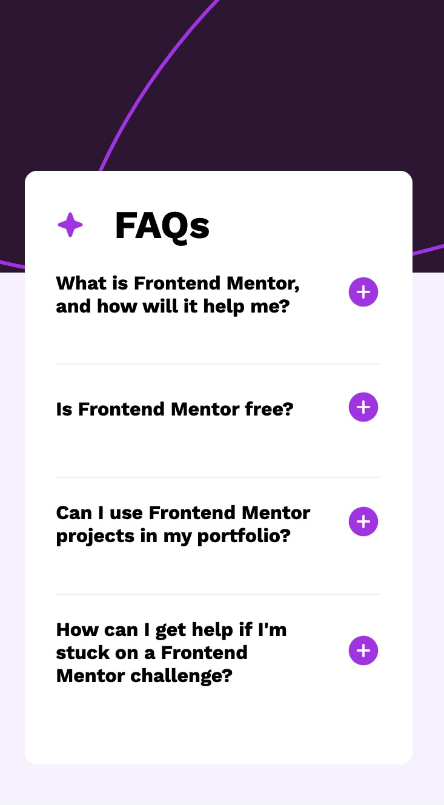
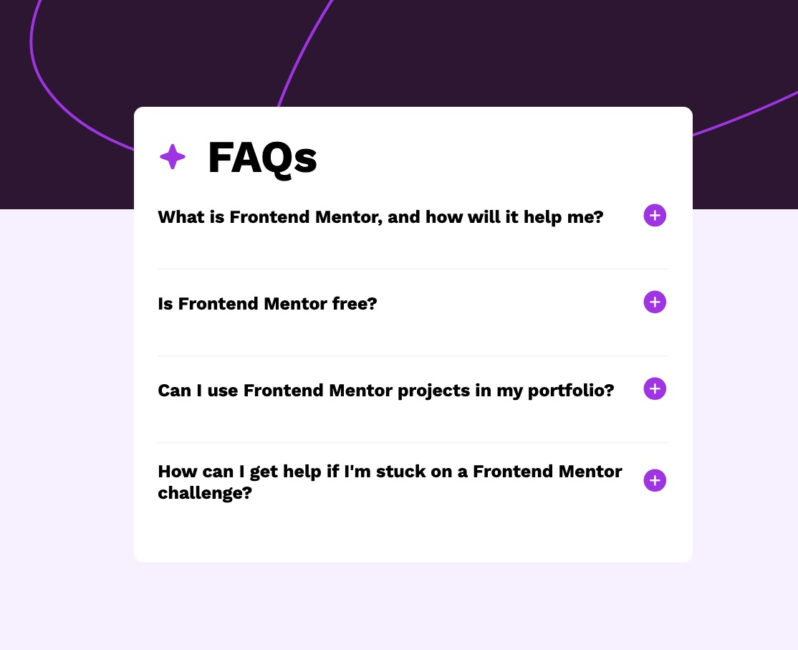

# Frontend Mentor - FAQ accordion solution

This is a solution to the [FAQ accordion challenge on Frontend Mentor](https://www.frontendmentor.io/challenges/faq-accordion-wyfFdeBwBz). Frontend Mentor challenges help you improve your coding skills by building realistic projects.

## Table of contents

-   [Overview](#overview)
    -   [The challenge](#the-challenge)
    -   [Screenshot](#screenshot)
    -   [Links](#links)
-   [My process](#my-process)
    -   [Built with](#built-with)
    -   [What I learned](#what-i-learned)
    -   [Continued development](#continued-development)

## Overview

### The challenge

Users should be able to:

-   Hide/Show the answer to a question when the question is clicked
-   Navigate the questions and hide/show answers using keyboard navigation alone
-   View the optimal layout for the interface depending on their device's screen size
-   See hover and focus states for all interactive elements on the page

### Screenshot




### Links

-   Solution URL: [Add solution URL here](https://your-solution-url.com)
-   Live Site URL: [Add live site URL here](https://your-live-site-url.com)

## My process

### Built with

-   Semantic HTML5 markup
-   CSS custom properties
-   Flexbox
-   Mobile-first workflow

### What I learned

I learned how to create an accordion using vanilla JavaScript. I found it very useful to use ARIA attributes such as aria-expanded="false" and aria-controls="faq1".

```html
<div class="question-wrapper">
    <h2
        class="question"
        tabindex="0"
        aria-expanded="false"
        aria-controls="faq1"
    >
        question
    </h2>
    ...
</div>
<div id="faq1" class="hidden">
    <p>answer</p>
</div>
```

```css
.hidden {
    height: 0;
    opacity: 0;
    overflow: hidden;
    transition: height 0.3s ease-in-out, opacity 0.3s ease-in-out;
}

.visible {
    height: 90px;
    opacity: 1;
    transition: height 0.3s ease-in-out, opacity 0.3s ease-in;
}
```

### Continued development

I got stuck on styling when the height changed. I'll continue learning about CSS. In addition, I'll learn more about the usage of ARIA attributes.
# faq-accordion-main
